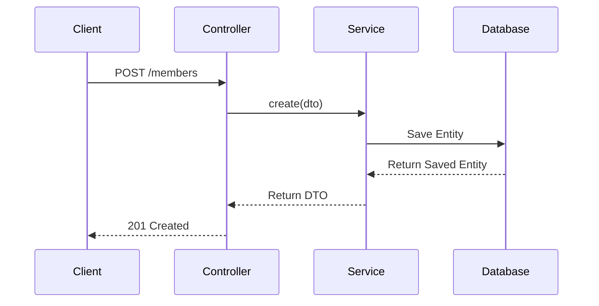

# Members Module

## Purpose
This module manages community's members. 

---

## Business Logic & Rules

### Doman dictionary
* Member represent community member, why have contact info and system role
* Member Roles:
  * Admin - portal admin who administrates whole site, he approves creating comunity

### Rules
1. **Rule 1:** A new member cannot be invited with an existing email.
2. **Rule 2:** A new member can be registered only with email from invite
3. **Rule 3:** An invitation can be used only within 3 days
4. **Rule 4:** 
5. **Rule 5:** 

### Operations
* Invite member
* Register member by invite
* 

### Questions
* Should system allows invite member out of community
---

## Workflow Diagram

TBD

