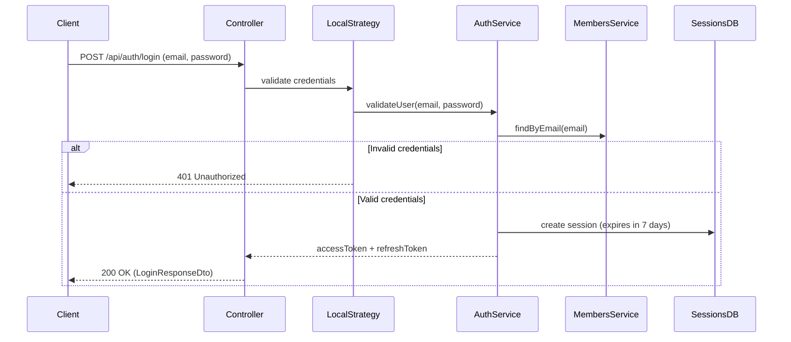
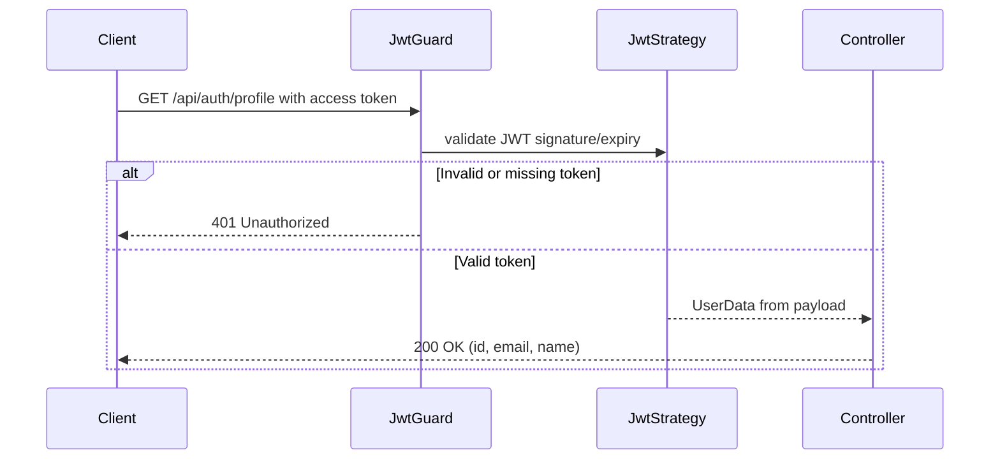
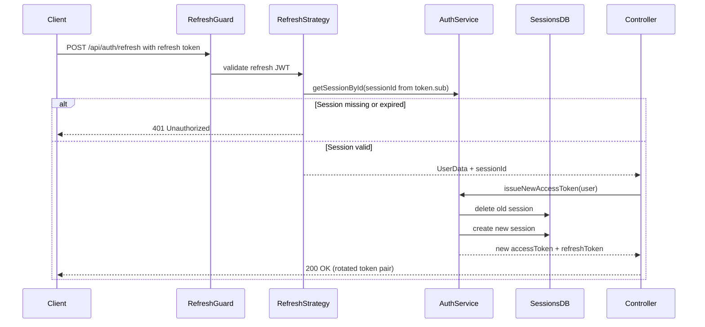
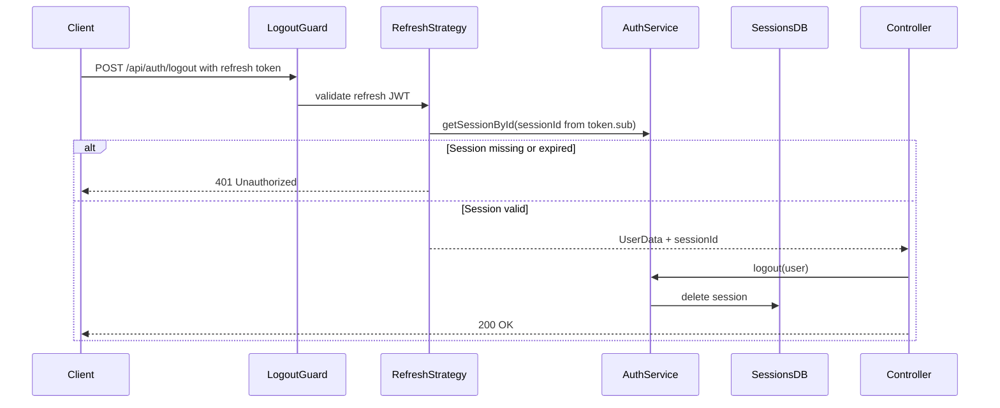

# Auth Module

## Purpose
This module manages authentication for members, including login, access-token protected profile access, and refresh-token rotation via persisted sessions.

---

## Business Logic & Rules

### Domain Dictionary
* **Access Token** - Short-lived JWT used to access protected API endpoints
* **Refresh Token** - Longer-lived JWT used only to obtain a new access token
* **Session** - Persisted server-side record that binds a refresh token to a member and expiry window
* **UserData** - Authenticated member identity projected from validated tokens/credentials

### Business Rules
1. **Global JWT Protection:** The module registers JWT auth as an application-level guard. Endpoints must explicitly opt out when using local or refresh strategies.
2. **Credential-Based Login:** Login succeeds only if email exists and password matches the stored member hash.
3. **Session-Backed Refresh:** Each login creates a DB session and issues a refresh token whose `sub` is the session ID.
4. **Refresh Token Rotation:** Refresh deletes the current session and creates a new one, invalidating the old refresh token.
5. **Session Expiration Enforcement:** Refresh requests are rejected when the session is missing or expired.

### Core Operations
* **Login** - Validate credentials and issue access + refresh tokens
* **Get Profile** - Return authenticated member identity from access token
* **Refresh Tokens** - Validate refresh token and rotate session/tokens
* **Logout** - Revoke current refresh session to terminate token rotation

---

## API Endpoints

| Method | Endpoint | Description | Request Body |
|--------|----------|-------------|--------------|
| POST | `/api/auth/login` | Authenticate member and issue token pair | `LoginDto` |
| GET | `/api/auth/profile` | Return current authenticated user | - |
| POST | `/api/auth/refresh` | Rotate refresh session and issue new token pair | - |
| POST | `/api/auth/logout` | Revoke current refresh session | - |

### Validation Rules

**LoginDto:**
- `email`: Required, valid email format
- `password`: Required, non-empty string

### Authentication Notes

- `POST /api/auth/login` uses local strategy (`email` + `password`) and returns `LoginResponseDto`.
- `GET /api/auth/profile` requires a valid access token in `Authorization: Bearer <token>`.
- `POST /api/auth/refresh` requires a valid refresh token in `Authorization: Bearer <token>`.
- `POST /api/auth/logout` requires a valid refresh token and revokes the underlying session.

---

## Workflow Diagrams

### Login Flow

### Profile Access Flow

### Refresh Flow (Token Rotation)

### Logout Flow

---

## Open Questions & Future Considerations

1. **Refresh Reuse Detection:** Should we add telemetry/audit when an already-rotated refresh token is reused (possible token theft signal)?
2. **Session Metadata:** Should sessions store IP/device/user-agent for security monitoring and selective revocation?
3. **Global Logout:** Should we add "logout all devices" to revoke all active sessions for the member?
4. **Session Cleanup:** Should expired sessions be removed via scheduled cleanup job?
