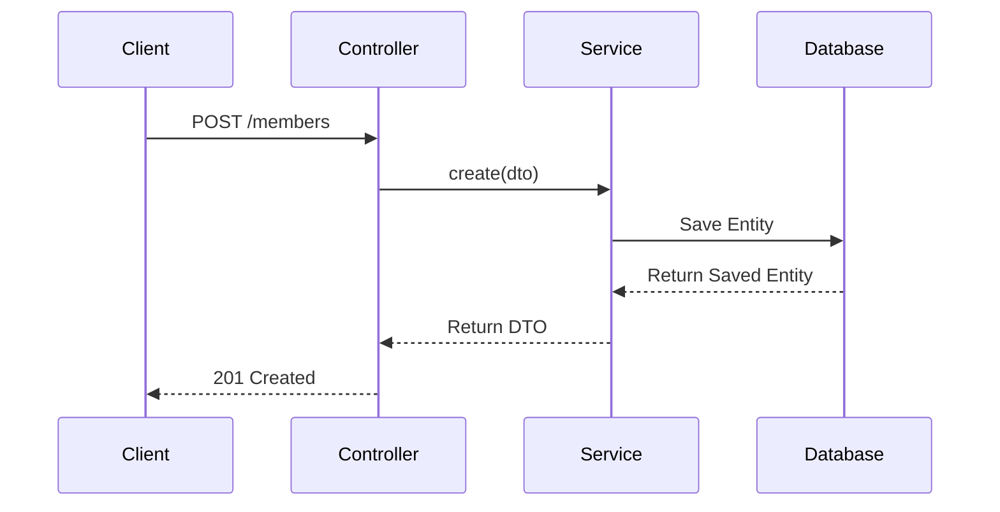

# Members Module

## Purpose
This module manages community's members. 

---

## Business Logic & Rules

### Domain dictionary
* Member represent community member, why have contact info and system role
* Member Roles:
  * Admin - portal admin who administrates whole site, he approves creating comunity

### Rules
1. **Rule 1:** Inviting a member by email is idempotent. If an invitation already exists for the given email, the existing invite is reused and its token is refreshed instead of creating a duplicate.
2. **Rule 2:** A new member can be registered only with an email address that has a valid invitation.

### Operations
* Invite member
* Register member by invite
* 

### Questions
* Should system allows invite member out of community
---

## Workflow Diagram

TBD

