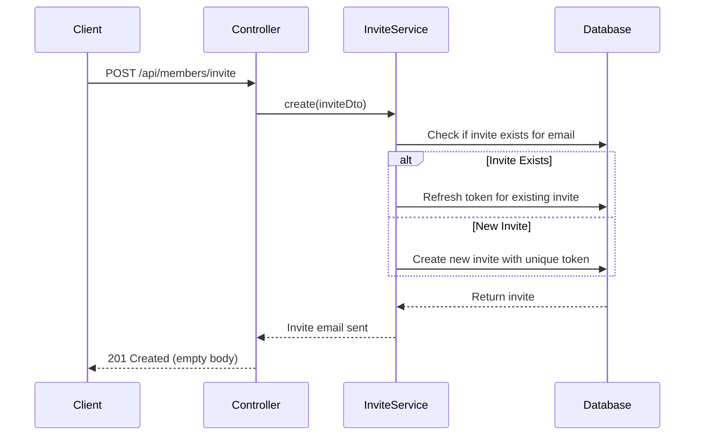
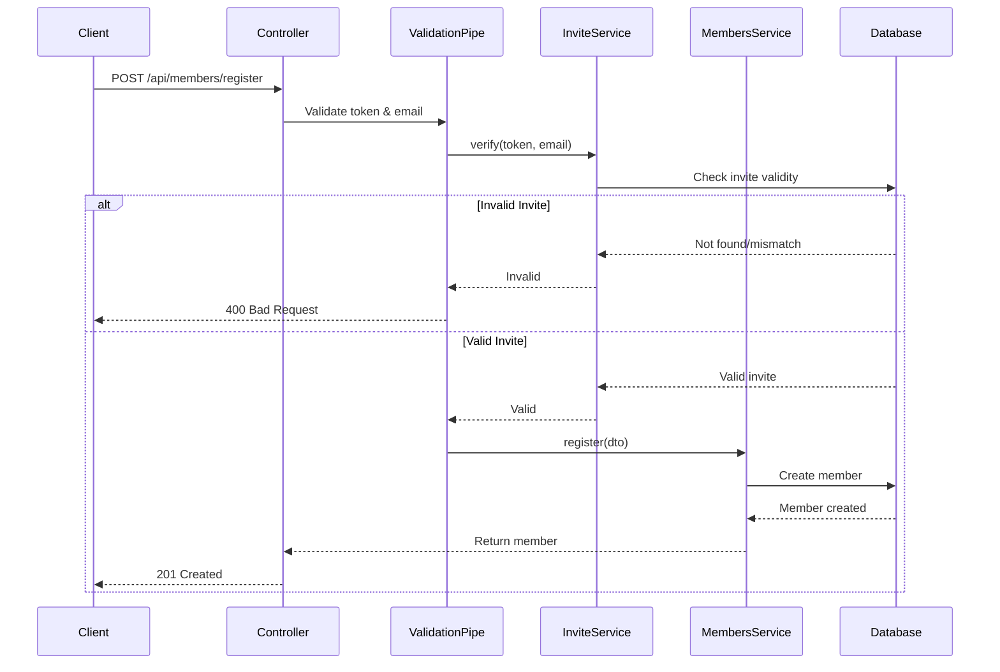
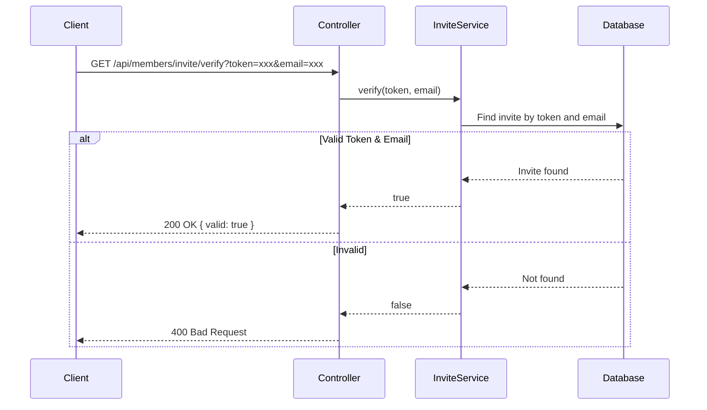

# Members Module

## Purpose
This module manages the community's members, handling the complete lifecycle from invitation through registration to member management.

---

## Business Logic & Rules

### Domain Dictionary
* **Member** - Represents a registered community member who has contact information
* **Member Invite** - Represents an invitation sent to a prospective member, containing a unique token for verification

### Business Rules
1. **Idempotent Invitations:** Inviting a member by email is idempotent. If an invitation already exists for the given email, the existing invite is reused and its token is refreshed instead of creating a duplicate.
2. **Invite-Only Registration:** A new member can be registered only with an email address that has a valid invitation token.
3. **Email Uniqueness:** Each member must have a unique email address in the system.

### Core Operations
* **Invite Member** - Create an invitation for a prospective member
* **Verify Invitation** - Check if an invitation token is valid for a given email
* **Register Member** - Convert a valid invitation into an active member account
* **List Members** - Retrieve all registered members
* **Get Member** - Retrieve a specific member by ID
* **Update Member Name** - Modify a member's name
* **Delete Member** - Remove a member from the system

---

## API Endpoints

| Method | Endpoint | Description | Request Body |
|--------|----------|-------------|--------------|
| POST | `/api/members/invite` | Create a member invitation | `CreateMemberInviteDto` |
| GET | `/api/members/invite/verify?token=&email=` | Verify invitation token | Query params |
| POST | `/api/members/register` | Register a new member with valid invite | `RegisterMemberDto` |
| GET | `/api/members` | Get all members | - |
| GET | `/api/members/:id` | Get member by ID | - |
| PUT | `/api/members/:id/name` | Update member's name | `UpdateMemberNameDto` |
| DELETE | `/api/members/:id` | Delete a member | - |

### Validation Rules

**CreateMemberInviteDto:**
- `name`: Required, non-empty string
- `email`: Required, valid email format

**RegisterMemberDto:**
- `token`: Required, non-empty string (must match a valid invitation)
- `name`: Required, non-empty string
- `email`: Required, valid email format (must match the invitation email)

**UpdateMemberNameDto:**
- `name`: Required, non-empty string

---

## Workflow Diagrams

### Member Invitation Flow

### Member Registration Flow

### Invitation Verification Flow

---

## Open Questions & Future Considerations

1. **Community Scope:** Should the system allow inviting members outside of a specific community context, or should invites always be community-scoped?
2. **Invitation Expiration:** Currently there's no expiration logic for invitations (see TODO in entity). Should invites expire after a certain period?
3. **Roles & Permissions:** The Member entity doesn't currently include role information. Should we add role-based access control (RBAC)?
4. **Invite Cleanup:** Should expired or used invitations be automatically removed from the database?
5. **Email Notifications:** Is there a separate service handling the actual sending of invitation emails?
6. **Audit Trail:** Should we track who invited whom and when members registered?

